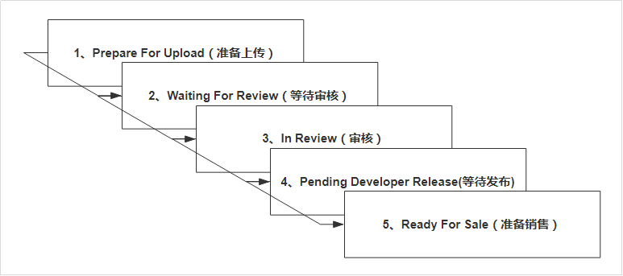

# 审核流程

<figure><figcaption></figcaption></figure>

1. **预审**(Prepare For Upload)：通过Xcode或Transporter等上传iPA的过程；
   1. **作用**：主要是扫描API；
   2. **时间**：一般10\~30分钟；
   3. **注意事项**：关注邮件和上传状态，有些上传完成单还是可能被扫描拒绝会回复邮件；
   4. **结果**： 结束后会iPA会在iTC中显示，可在TestFlight中查看；
2. **机审(Waiting For Review)：** 对代码进行机器审核；
   1. **作用**：排查APP是否是重复应用；
   2. **时间**：一天内，一般机审会在24小时内进入人工审核阶段，或者被机审拒绝；
   3. **结果**：进入人工审核；
3. **人工审核**(In Review)：
   1. **作用**：啊主要检查APP元数据（封面、功能、体验等，比较注重用户体验）
   2. **环境**：审核人员统一使用的iPad在wifi环境下审核，一般都会使用最新版本的系统；
   3. **注意事项**：一定要兼容最新版本的系统
   4. **时间**：2小时内；一般进入人工审核后很快就会出审核结果；
   5. **结果**：审核通过，等待开发者发布应用
4. **等待发布(Pending Developing Release)**：啊等待开发者发布到应用市场
   1. **作用**：开发者发布应用
   2. **时间**：10\~30分钟，一般发布后很快就能在AppStore看到审核结果，如果2小时还是无法看到新版本的APP，可能是Apple系统的问题或缓存延迟，联系人工客服会有可能在24小时内解决；
   3. **结果**：上架成功
5. **已上架(Ready For Sale)**：此时用户可在AppStore中搜索到
